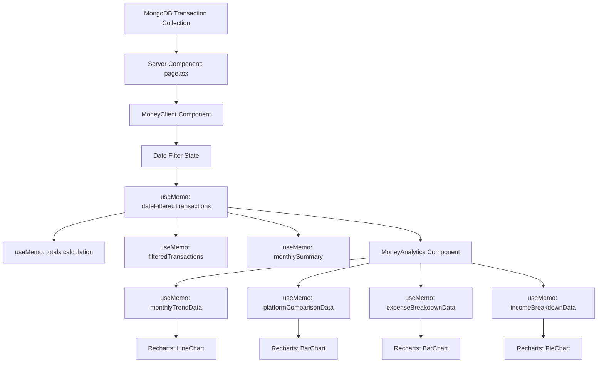

# Design Document: Money Page Analytics

## Overview

The Money Page Analytics feature extends the existing Money Management system with advanced data visualization, filtering, and export capabilities. This enhancement transforms raw transaction data into actionable insights through interactive charts, configurable date ranges, and comprehensive reporting tools.

### Core Capabilities

- **Interactive Data Visualization**: Line charts for trends, bar charts for comparisons, pie charts for distributions
- **Flexible Date Filtering**: Preset periods (This Month, Last 3 Months, This Year) and custom date ranges
- **Multi-Platform Analysis**: Compare performance across Freelancer, Direct, Upwork, and Fiverr platforms
- **Export Functionality**: Generate CSV and PDF reports for external analysis
- **Responsive Design**: Optimized for mobile, tablet, and desktop viewing
- **Real-time Updates**: Charts and metrics update dynamically based on filter selections

### Technology Stack

- **Frontend Framework**: Next.js 16.2.6 (React 19.2.4)
- **Charting Library**: Recharts 3.8.1
- **Styling**: Tailwind CSS 4 with custom gradients
- **State Management**: React hooks (useState, useMemo)
- **Data Layer**: MongoDB via Mongoose
- **Type Safety**: TypeScript 5

### Design Principles

1. **Progressive Enhancement**: Core functionality works without JavaScript, enhanced with interactivity
2. **Performance First**: Memoized calculations, lazy rendering, optimized re-renders
3. **Accessibility**: WCAG 2.1 AA compliance for charts and interactive elements
4. **Consistency**: Matches existing Money Management UI patterns and color schemes
5. **Extensibility**: Modular architecture supports future analytics additions

## Architecture

### Component Hierarchy

```
MoneyClient (app/money/MoneyClient.tsx)
├── Date Range Filter Controls
├── View Mode Toggle (List/Analytics)
├── Period Toggle (Monthly/Yearly)
├── Export Dropdown (CSV/PDF)
├── Overview Cards (Income/Expense/Profit)
├── Platform Breakdown Cards
├── [List View]
│   └── Transactions Table
└── [Analytics View]
    ├── MoneyAnalytics Component
    │   ├── Income/Expense Trend Chart
    │   ├── Platform Comparison Chart
    │   ├── Income Distribution Chart
    │   └── Expense Breakdown Chart
    ├── Monthly Summary Table
    └── Platform-Wise Breakdown Table
```

### Data Flow



### State Management Strategy

**Client-Side State (MoneyClient)**
- `viewMode`: 'list' | 'analytics' - Controls which view is displayed
- `viewPeriod`: 'monthly' | 'yearly' - Aggregation granularity for charts
- `dateRange`: 'thisMonth' | 'last3Months' | 'thisYear' | 'custom' - Date filter selection
- `customStartDate`: string - Custom range start date
- `customEndDate`: string - Custom range end date
- `filterPlatform`: string - Platform filter for list view
- `filterType`: string - Transaction type filter for list view
- `searchQuery`: string - Text search for list view

**Derived State (useMemo)**
- `dateFilteredTransactions`: Transactions filtered by date range
- `totals`: Aggregated income, expense, profit
- `filteredTransactions`: Transactions filtered by platform, type, search
- `monthlySummary`: Monthly aggregation for summary table

**Analytics Component State (useMemo)**
- `monthlyTrendData`: Time-series data for line chart
- `platformComparisonData`: Platform aggregation for bar chart
- `expenseBreakdownData`: Category aggregation for pie chart
- `incomeBreakdownData`: Platform income for pie chart

### Performance Optimizations

1. **Memoization**: All expensive calculations wrapped in useMemo with proper dependencies
2. **Lazy Rendering**: Charts only render when Analytics view is active
3. **Debounced Search**: Search input debounced to reduce re-renders (future enhancement)
4. **Virtual Scrolling**: For transaction lists exceeding 100 items (future enhancement)
5. **Code Splitting**: MoneyAnalytics component can be lazy-loaded

## Components and Interfaces

### MoneyClient Component

**Location**: `app/money/MoneyClient.tsx`

**Props Interface**:
```typescript
interface MoneyClientProps {
  initialTransactions: Transaction[];
  platformSummary: PlatformSummary;
}

interface Transaction {
  _id: string;
  date: string; // ISO 8601 format
  platform: 'Freelancer' | 'Direct' | 'Upwork' | 'Fiverr';
  type: 'Income' | 'Expense';
  category: string;
  amount: number;
  description: string;
}

interface PlatformSummary {
  [platform: string]: {
    income: number;
    expense: number;
    profit: number;
  };
}
```

**Responsibilities**:
- Manage view state (list vs analytics)
- Handle date range filtering
- Calculate derived metrics (totals, monthly summary)
- Coordinate export operations
- Render overview cards and platform breakdown
- Conditionally render List or Analytics view

### MoneyAnalytics Component

**Location**: `components/MoneyAnalytics.tsx`

**Props Interface**:
```typescript
interface MoneyAnalyticsProps {
  transactions: Transaction[];
  viewPeriod: 'monthly' | 'yearly';
}
```

**Responsibilities**:
- Transform transaction data into chart-ready formats
- Render four primary charts:
  1. Income/Expense Trend (LineChart)
  2. Platform Comparison (BarChart)
  3. Income Distribution (PieChart)
  4. Expense Breakdown (BarChart)
- Handle responsive chart sizing
- Format currency values for display
- Manage chart tooltips and legends

### Date Filter Component (Inline)

**Location**: Inline in MoneyClient

**State**:
```typescript
const [dateRange, setDateRange] = useState<'thisMonth' | 'last3Months' | 'thisYear' | 'custom'>('thisMonth');
const [customStartDate, setCustomStartDate] = useState('');
const [customEndDate, setCustomEndDate] = useState('');
```

**Logic**:
```typescript
const dateFilteredTransactions = useMemo(() => {
  const now = new Date();
  let startDate: Date;
  let endDate: Date = now;

  switch (dateRange) {
    case 'thisMonth':
      startDate = new Date(now.getFullYear(), now.getMonth(), 1);
      break;
    case 'last3Months':
      startDate = new Date(now.getFullYear(), now.getMonth() - 3, 1);
      break;
    case 'thisYear':
      startDate = new Date(now.getFullYear(), 0, 1);
      break;
    case 'custom':
      if (customStartDate && customEndDate) {
        startDate = new Date(customStartDate);
        endDate = new Date(customEndDate);
      } else {
        return initialTransactions;
      }
      break;
    default:
      return initialTransactions;
  }

  return initialTransactions.filter((t) => {
    const tDate = new Date(t.date);
    return tDate >= startDate && tDate <= endDate;
  });
}, [initialTransactions, dateRange, customStartDate, customEndDate]);
```

### Export Service

**Location**: `lib/exportUtils.ts`

**Functions**:

```typescript
export function exportToCSV(
  transactions: Transaction[],
  filename: string
): void;

export function exportToPDF(
  transactions: Transaction[],
  platformSummary: PlatformSummary,
  totals: { income: number; expense: number; profit: number },
  filename: string
): void;
```

**CSV Export Logic**:
- Headers: Date, Platform, Type, Category, Amount, Description
- Date format: ISO 8601 (YYYY-MM-DD)
- Amount format: Decimal with 2 places
- Special character escaping: RFC 4180 compliant
- Filename pattern: `transactions-YYYY-MM-DD.csv`

**PDF Export Logic**:
- Uses browser print API with styled HTML
- Sections: Header, Summary Cards, Platform Breakdown, Transaction List
- Font sizes: 12pt body, 16pt headings
- Filename pattern: `financial-report-YYYY-MM-DD.pdf`
- Transaction limit: 50 for performance

## Data Models

### Transaction Model

**Location**: `models/Transaction.ts`

```typescript
interface ITransaction {
  _id: ObjectId;
  date: Date;
  platform: 'Freelancer' | 'Direct' | 'Upwork' | 'Fiverr';
  type: 'Income' | 'Expense';
  category: string;
  amount: number;
  description: string;
  createdAt: Date;
  updatedAt: Date;
}
```

**Indexes**:
- `{ date: -1 }` - For date range queries
- `{ platform: 1, date: -1 }` - For platform-specific queries
- `{ type: 1, date: -1 }` - For income/expense filtering

### Chart Data Models

**Monthly Trend Data**:
```typescript
interface MonthlyTrendDataPoint {
  month: string; // "Jan 2024" or "2024"
  income: number;
  expense: number;
  profit: number;
}
```

**Platform Comparison Data**:
```typescript
interface PlatformComparisonDataPoint {
  platform: string;
  income: number;
  expense: number;
  profit: number;
}
```

**Expense Breakdown Data**:
```typescript
interface ExpenseBreakdownDataPoint {
  name: string; // category name
  value: number; // amount
}
```

**Income Distribution Data**:
```typescript
interface IncomeDistributionDataPoint {
  name: string; // platform name
  value: number; // amount
}
```

### Monthly Summary Model

```typescript
interface MonthlySummaryRow {
  month: string; // "January 2024"
  transactions: number;
  income: number;
  expense: number;
  profit: number;
  margin: string; // "25.5%" or "N/A"
}
```

## Correctness Properties

*A property is a characteristic or behavior that should hold true across all valid executions of a system—essentially, a formal statement about what the system should do. Properties serve as the bridge between human-readable specifications and machine-verifiable correctness guarantees.*

### Property 1: Transaction Aggregation Accuracy

*For any* set of transactions and any grouping criteria (platform, category, or time period), the sum of transaction amounts within each group SHALL equal the sum of individual transaction amounts in that group, calculated with precision to two decimal places.

**Validates: Requirements 2.1, 3.1, 15.1**

### Property 2: Currency Formatting Consistency

*For any* numeric amount (positive, negative, or zero), the formatted output SHALL include a currency symbol, exactly two decimal places, thousand separators for values >= 1000, and a minus sign prefix for negative values.

**Validates: Requirements 2.4, 3.8, 6.4, 8.6, 8.11**

### Property 3: Profit Calculation Correctness

*For any* pair of income and expense values, the calculated profit SHALL equal (income - expense), and when income is greater than zero, the profit margin SHALL equal ((profit / income) × 100).

**Validates: Requirements 2.6, 8.3, 15.2, 15.3**

### Property 4: Date Range Filtering Inclusivity

*For any* set of transactions and any date range with start and end dates, the filtered result SHALL include all and only those transactions whose date field falls within the range boundaries inclusive of both start and end dates.

**Validates: Requirements 5.2, 5.3, 5.4, 15.5**

### Property 5: Date Validation Correctness

*For any* pair of dates (start, end), the validation function SHALL return true if and only if the end date is after or equal to the start date, and both dates are valid calendar dates.

**Validates: Requirements 5.6**

### Property 6: Descending Sort Preservation

*For any* collection of items with a numeric sort key (income, date, profit), the sorted output SHALL have each element's sort key greater than or equal to the next element's sort key.

**Validates: Requirements 2.5, 8.5**

### Property 7: Percentage Calculation Accuracy

*For any* category amount and total amount where total is greater than zero, the calculated percentage SHALL equal (category_amount / total) × 100, rounded to one decimal place using round-half-up rules.

**Validates: Requirements 3.2, 15.8**

### Property 8: Small Category Grouping

*For any* set of expense categories, all categories representing less than 3% of total expenses SHALL be grouped into a single "Other" category, and the "Other" category's amount SHALL equal the sum of all grouped categories.

**Validates: Requirements 3.6**

### Property 9: CSV Data Completeness

*For any* set of transactions, the generated CSV output SHALL contain exactly one row per transaction (excluding the header row), and each row SHALL contain all transaction fields in the specified column order.

**Validates: Requirements 6.1**

### Property 10: ISO 8601 Date Formatting

*For any* valid date value, the formatted output SHALL match the pattern YYYY-MM-DD where YYYY is a 4-digit year, MM is a 2-digit month (01-12), and DD is a 2-digit day (01-31).

**Validates: Requirements 6.3**

### Property 11: CSV Filename Pattern Compliance

*For any* export date, the generated filename SHALL match the pattern "transactions-YYYY-MM-DD.csv" where YYYY-MM-DD represents the export date in ISO 8601 format.

**Validates: Requirements 6.5**

### Property 12: RFC 4180 CSV Escaping

*For any* string containing special characters (commas, quotes, newlines), the CSV output SHALL escape these characters according to RFC 4180 specification: fields containing special characters SHALL be enclosed in double quotes, and double quotes within fields SHALL be escaped as two consecutive double quotes.

**Validates: Requirements 6.12**

### Property 13: Month Filtering Accuracy

*For any* set of transactions, the monthly summary SHALL include one and only one row for each unique month that contains at least one transaction in the selected date range.

**Validates: Requirements 8.9**

### Property 14: Deleted Transaction Exclusion

*For any* set of transactions containing items marked as deleted, all calculated metrics (totals, averages, counts) SHALL exclude deleted transactions from their calculations.

**Validates: Requirements 15.6**

### Property 15: Negative Amount Handling

*For any* transaction with a negative amount value, the transaction SHALL be processed according to its type field (Income or Expense) without inverting the sign of the amount.

**Validates: Requirements 15.7**

### Property 16: Timezone-Aware Grouping

*For any* set of transactions, when grouped by time period (month or year), the grouping SHALL use the date field interpreted in the user's local timezone, ensuring transactions are assigned to the correct period based on local time.

**Validates: Requirements 15.9**

## Testing Strategy

### Unit Testing Approach

This feature combines **data aggregation logic** (suitable for property-based testing) with **UI rendering and visualization** (not suitable for property-based testing). Property-based testing IS appropriate for:

- **Pure calculation functions**: Aggregation, profit calculation, percentage calculation, formatting
- **Data transformation logic**: Filtering, sorting, grouping, date range operations
- **String formatting**: Currency formatting, date formatting, CSV escaping
- **Business rules**: Category grouping, deleted transaction exclusion, negative amount handling

Property-based testing is **NOT appropriate** for:
- **UI Rendering**: Charts, tables, and visual components (use snapshot tests)
- **External Library Behavior**: Recharts handles chart rendering (use integration tests)
- **Browser APIs**: Download triggers, print API (use integration tests)
- **Performance requirements**: Timing constraints (use performance tests)

### Testing Strategy

**Property-Based Tests** (Core Business Logic):
- **Test Library**: fast-check (JavaScript/TypeScript property-based testing library)
- **Minimum Iterations**: 100 runs per property test
- **Property Tagging**: Each test MUST include a comment referencing the design property
  - Format: `// Feature: money-page-analytics, Property {number}: {property_text}`
- **Coverage**: All 16 correctness properties MUST have corresponding property-based tests

**Example Property Test Structure**:
```typescript
import fc from 'fast-check';

// Feature: money-page-analytics, Property 1: Transaction Aggregation Accuracy
test('transaction aggregation sums correctly for any grouping', () => {
  fc.assert(
    fc.property(
      fc.array(transactionArbitrary()),
      fc.constantFrom('platform', 'category', 'month'),
      (transactions, groupBy) => {
        const grouped = groupTransactions(transactions, groupBy);
        const groupedSum = Object.values(grouped).reduce((sum, group) => 
          sum + group.reduce((s, t) => s + t.amount, 0), 0
        );
        const directSum = transactions.reduce((sum, t) => sum + t.amount, 0);
        expect(groupedSum).toBeCloseTo(directSum, 2);
      }
    ),
    { numRuns: 100 }
  );
});
```

**Unit Tests** (Specific Examples and Edge Cases):
- **Date Filtering Logic**: Test each preset (This Month, Last 3 Months, This Year) with known dates
- **Custom Date Range Validation**: Test edge cases (end before start, future dates, invalid dates)
- **Empty State Handling**: Test with empty arrays, zero values, null fields
- **Zero Division**: Test profit margin calculation when income is zero (should return "N/A")
- **Small Category Grouping**: Test categories exactly at 3% threshold
- **Negative Amounts**: Test transactions with negative values
- **Deleted Transactions**: Test that deleted items are excluded from calculations
- **Chart Configuration**: Test that Recharts receives correct data structure and props

**Integration Tests**:
- **Chart Rendering**: Verify charts render without errors given valid data
- **Filter Interactions**: Test that changing filters updates displayed data
- **Export Downloads**: Verify CSV/PDF files are generated and downloadable
- **View Mode Switching**: Test transition between List and Analytics views
- **Period Toggle**: Verify monthly/yearly aggregation switches correctly
- **Tooltip Interactions**: Test hover behavior and tooltip display

**Example Unit Test Cases**:

```typescript
describe('Date Filtering', () => {
  it('should filter transactions for current month', () => {
    const transactions = [
      { date: '2024-01-15', amount: 100 },
      { date: '2024-02-15', amount: 200 },
      { date: '2024-03-15', amount: 300 },
    ];
    const filtered = filterByDateRange(transactions, 'thisMonth');
    expect(filtered).toHaveLength(1);
    expect(filtered[0].amount).toBe(300); // March transaction
  });

  it('should return empty array when end date is before start date', () => {
    const transactions = [{ date: '2024-01-15', amount: 100 }];
    const filtered = filterByCustomRange(transactions, '2024-02-01', '2024-01-01');
    expect(filtered).toHaveLength(0);
  });
});

describe('Aggregation Calculations', () => {
  it('should calculate correct totals', () => {
    const transactions = [
      { type: 'Income', amount: 1000 },
      { type: 'Income', amount: 500 },
      { type: 'Expense', amount: 300 },
    ];
    const totals = calculateTotals(transactions);
    expect(totals.income).toBe(1500);
    expect(totals.expense).toBe(300);
    expect(totals.profit).toBe(1200);
  });

  it('should calculate profit margin as N/A when income is zero', () => {
    const data = { income: 0, expense: 100, profit: -100 };
    const margin = calculateProfitMargin(data);
    expect(margin).toBe('N/A');
  });
});

describe('CSV Export', () => {
  it('should escape special characters in description', () => {
    const transactions = [
      { description: 'Payment for "Project A"', amount: 100 }
    ];
    const csv = generateCSV(transactions);
    expect(csv).toContain('"Payment for ""Project A"""');
  });

  it('should generate header-only CSV when no transactions', () => {
    const csv = generateCSV([]);
    expect(csv.split('\n')).toHaveLength(1);
    expect(csv).toContain('Date,Platform,Type,Category,Amount,Description');
  });
});
```

**Manual Testing**:
- Visual regression testing for chart appearance
- Cross-browser testing (Chrome, Firefox, Safari, Edge)
- Responsive design testing on actual devices
- Accessibility testing with screen readers
- Performance testing with large datasets (1000+ transactions)

### Test Coverage Goals

- **Property-Based Tests**: 100% coverage of all 16 correctness properties (minimum 100 iterations each)
- **Unit Tests**: 80% coverage for business logic functions (aggregation, formatting, filtering)
- **Integration Tests**: Cover all user workflows (filtering, exporting, view switching, chart interactions)
- **Manual Tests**: All acceptance criteria validated on multiple devices/browsers

## Error Handling

### Client-Side Error Handling

**Date Validation Errors**:
```typescript
// Custom date range validation
if (customEndDate && customStartDate && new Date(customEndDate) < new Date(customStartDate)) {
  toast.error('End date must be after or equal to start date');
  return;
}
```

**Chart Rendering Errors**:
```typescript
// Wrap chart components in error boundaries
<ErrorBoundary fallback={<ChartErrorFallback />}>
  <ResponsiveContainer width="100%" height={300}>
    <LineChart data={monthlyTrendData}>
      {/* Chart configuration */}
    </LineChart>
  </ResponsiveContainer>
</ErrorBoundary>
```

**Export Errors**:
```typescript
try {
  exportToCSV(filteredTransactions, filename);
  toast.success('CSV exported successfully');
} catch (error) {
  console.error('CSV export failed:', error);
  toast.error('Failed to export CSV. Please try again.');
}
```

**Data Loading Errors**:
```typescript
// In server component (page.tsx)
try {
  const transactions = await Transaction.find().sort({ date: -1 }).lean();
  return <MoneyClient initialTransactions={transactions} />;
} catch (error) {
  console.error('Failed to load transactions:', error);
  return <ErrorState message="Failed to load transactions" />;
}
```

### Empty State Handling

**No Transactions in Date Range**:
```typescript
{dateFilteredTransactions.length === 0 ? (
  <div className="text-center py-12">
    <BarChart3 size={48} className="mx-auto text-slate-300 mb-4" />
    <h3 className="text-lg font-semibold text-slate-700 dark:text-slate-300 mb-2">
      No data for selected period
    </h3>
    <p className="text-slate-500 dark:text-slate-400 mb-4">
      Try selecting a different date range or add transactions
    </p>
    <button
      onClick={() => setIsAddModalOpen(true)}
      className="px-4 py-2 bg-gradient-to-r from-indigo-600 to-purple-600 text-white rounded-lg"
    >
      Add Transaction
    </button>
  </div>
) : (
  <MoneyAnalytics transactions={dateFilteredTransactions} viewPeriod={viewPeriod} />
)}
```

**No Expenses for Category Chart**:
```typescript
{expenseBreakdownData.length === 0 ? (
  <div className="text-center py-12">
    <p className="text-slate-500 dark:text-slate-400">
      No expense data available for the selected period
    </p>
  </div>
) : (
  <ResponsiveContainer width="100%" height={300}>
    <BarChart data={expenseBreakdownData} layout="vertical">
      {/* Chart configuration */}
    </BarChart>
  </ResponsiveContainer>
)}
```

### Loading States

**Initial Data Load**:
```typescript
// Server component handles loading
export default async function MoneyPage() {
  const transactions = await Transaction.find().sort({ date: -1 }).lean();
  const platformSummary = calculatePlatformSummary(transactions);
  
  return (
    <Suspense fallback={<MoneyLoadingSkeleton />}>
      <MoneyClient 
        initialTransactions={transactions}
        platformSummary={platformSummary}
      />
    </Suspense>
  );
}
```

**Chart Update Loading** (Future Enhancement):
```typescript
const [isUpdating, setIsUpdating] = useState(false);

const handleDateRangeChange = async (newRange: DateRange) => {
  setIsUpdating(true);
  setDateRange(newRange);
  // useMemo will recalculate automatically
  setTimeout(() => setIsUpdating(false), 300); // Smooth transition
};

{isUpdating && (
  <div className="absolute inset-0 bg-white/50 dark:bg-slate-900/50 flex items-center justify-center">
    <Loader2 className="animate-spin" size={32} />
  </div>
)}
```

### Performance Error Handling

**Large Dataset Warning**:
```typescript
useEffect(() => {
  if (filteredTransactions.length > 10000) {
    toast.warning('Large dataset detected. Export may take longer than expected.');
  }
}, [filteredTransactions.length]);
```

**Chart Render Timeout**:
```typescript
// If chart doesn't render within 3 seconds, show error
useEffect(() => {
  const timeout = setTimeout(() => {
    if (!chartRendered) {
      setChartError('Chart rendering timed out. Please try refreshing.');
    }
  }, 3000);
  
  return () => clearTimeout(timeout);
}, [chartRendered]);
```

## Implementation Notes

### Responsive Chart Configuration

**Viewport-Based Sizing**:
```typescript
const getChartHeight = () => {
  if (typeof window === 'undefined') return 300;
  return window.innerWidth < 768 ? 250 : 300;
};

const getFontSize = () => {
  if (typeof window === 'undefined') return 12;
  return Math.max(10, Math.min(16, 10 + window.innerWidth * 0.008));
};
```

**Mobile-Optimized Charts**:
```typescript
<ResponsiveContainer width="100%" height={getChartHeight()}>
  <LineChart data={monthlyTrendData}>
    <XAxis 
      dataKey="month" 
      stroke="#64748b"
      style={{ fontSize: `${getFontSize()}px` }}
      angle={window.innerWidth < 768 ? -45 : 0}
      textAnchor={window.innerWidth < 768 ? 'end' : 'middle'}
    />
    {/* Rest of chart configuration */}
  </LineChart>
</ResponsiveContainer>
```

### Color Consistency

**Platform Colors** (Shared across app):
```typescript
const PLATFORM_COLORS = {
  'Freelancer': '#3b82f6', // blue-500
  'Direct': '#a855f7',     // purple-500
  'Upwork': '#10b981',     // green-500
  'Fiverr': '#14b8a6',     // teal-500
};
```

**Chart Colors**:
- Income: `#10b981` (green-500)
- Expense: `#ef4444` (red-500)
- Profit: `#a855f7` (purple-500)
- Expense Categories: `['#ef4444', '#f97316', '#f59e0b', '#eab308', '#84cc16', '#22c55e']`

### Accessibility Considerations

**Keyboard Navigation**:
- All interactive elements (buttons, selects, date inputs) are keyboard accessible
- Tab order follows logical flow
- Focus indicators visible on all interactive elements

**Screen Reader Support**:
```typescript
<div role="region" aria-label="Financial Analytics Dashboard">
  <h2 id="income-trend-heading">Income vs Expense Trend</h2>
  <div aria-labelledby="income-trend-heading">
    <ResponsiveContainer width="100%" height={300}>
      <LineChart data={monthlyTrendData} aria-label="Line chart showing income and expense trends over time">
        {/* Chart configuration */}
      </LineChart>
    </ResponsiveContainer>
  </div>
</div>
```

**Color Contrast**:
- All text meets WCAG AA standards (4.5:1 for normal text, 3:1 for large text)
- Chart colors have sufficient contrast against backgrounds
- Dark mode maintains contrast ratios

**Alternative Text**:
- Charts include descriptive aria-labels
- Empty states include explanatory text
- Tooltips provide additional context

### Future Enhancements

1. **Advanced Filtering**:
   - Multi-select platform filter
   - Category-based filtering in analytics view
   - Amount range filtering

2. **Additional Charts**:
   - Cash flow projection chart
   - Year-over-year comparison
   - Category trends over time
   - Platform market share evolution

3. **Export Enhancements**:
   - Excel export with multiple sheets
   - Scheduled email reports
   - Chart image export (PNG/SVG)
   - Custom report templates

4. **Performance Optimizations**:
   - Virtual scrolling for large transaction lists
   - Chart data pagination
   - Web Worker for heavy calculations
   - IndexedDB caching for offline access

5. **Interactive Features**:
   - Click-to-drill-down on charts
   - Zoom and pan on time-series charts
   - Comparison mode (compare two time periods)
   - Annotations and notes on charts

6. **AI-Powered Insights**:
   - Anomaly detection (unusual expenses)
   - Trend predictions
   - Spending recommendations
   - Automated financial health score

## Deployment Considerations

### Build Optimization

**Code Splitting**:
```typescript
// Lazy load MoneyAnalytics component
const MoneyAnalytics = dynamic(() => import('@/components/MoneyAnalytics'), {
  loading: () => <ChartLoadingSkeleton />,
  ssr: false, // Charts don't need SSR
});
```

**Bundle Size**:
- Recharts is already included (3.8.1)
- No additional dependencies required
- Estimated bundle increase: ~5KB (gzipped)

### Database Optimization

**Indexes** (Already exist):
```javascript
// Transaction collection indexes
db.transactions.createIndex({ date: -1 });
db.transactions.createIndex({ platform: 1, date: -1 });
db.transactions.createIndex({ type: 1, date: -1 });
```

**Query Optimization**:
```typescript
// Use lean() for read-only queries
const transactions = await Transaction
  .find()
  .sort({ date: -1 })
  .lean()
  .exec();
```

### Monitoring

**Performance Metrics**:
- Chart render time (target: <300ms)
- Date filter update time (target: <500ms)
- Export generation time (CSV: <2s, PDF: <5s)
- Page load time (target: <2s)

**Error Tracking**:
- Log chart rendering failures
- Track export errors
- Monitor date validation errors
- Alert on performance degradation

### Browser Compatibility

**Supported Browsers**:
- Chrome 90+
- Firefox 88+
- Safari 14+
- Edge 90+

**Polyfills Required**:
- None (Next.js handles modern JavaScript features)

**Known Limitations**:
- PDF export uses browser print API (may vary by browser)
- Chart animations may be reduced on low-end devices
- Touch interactions require modern touch API support

## Security Considerations

### Data Privacy

**Client-Side Data**:
- Transaction data only sent to authenticated users
- No sensitive data in URLs or query parameters
- Export files generated client-side (no server upload)

**Export Security**:
- CSV/PDF generation happens in browser
- No transaction data sent to external services
- Files saved directly to user's device

### Input Validation

**Date Inputs**:
```typescript
// Validate custom date range
const validateDateRange = (start: string, end: string): boolean => {
  const startDate = new Date(start);
  const endDate = new Date(end);
  
  if (isNaN(startDate.getTime()) || isNaN(endDate.getTime())) {
    return false;
  }
  
  if (endDate < startDate) {
    return false;
  }
  
  return true;
};
```

**XSS Prevention**:
- All user input (descriptions, categories) sanitized before display
- React automatically escapes JSX content
- CSV export escapes special characters per RFC 4180

### Authentication

**Access Control**:
- Money page requires authentication (handled by Next.js middleware)
- Transaction data scoped to authenticated user
- No public access to financial data

## Conclusion

The Money Page Analytics feature provides comprehensive financial insights through interactive visualizations, flexible filtering, and robust export capabilities. The design leverages existing infrastructure (Recharts, Tailwind, MongoDB) while maintaining consistency with the current Money Management UI.

Key strengths of this design:
- **Performance**: Memoized calculations and lazy rendering ensure smooth interactions
- **Usability**: Intuitive controls and responsive design work across devices
- **Extensibility**: Modular architecture supports future enhancements
- **Reliability**: Comprehensive error handling and empty state management
- **Accessibility**: WCAG 2.1 AA compliant with keyboard and screen reader support

The implementation follows Next.js 16 best practices, uses TypeScript for type safety, and integrates seamlessly with the existing Money Management system.
